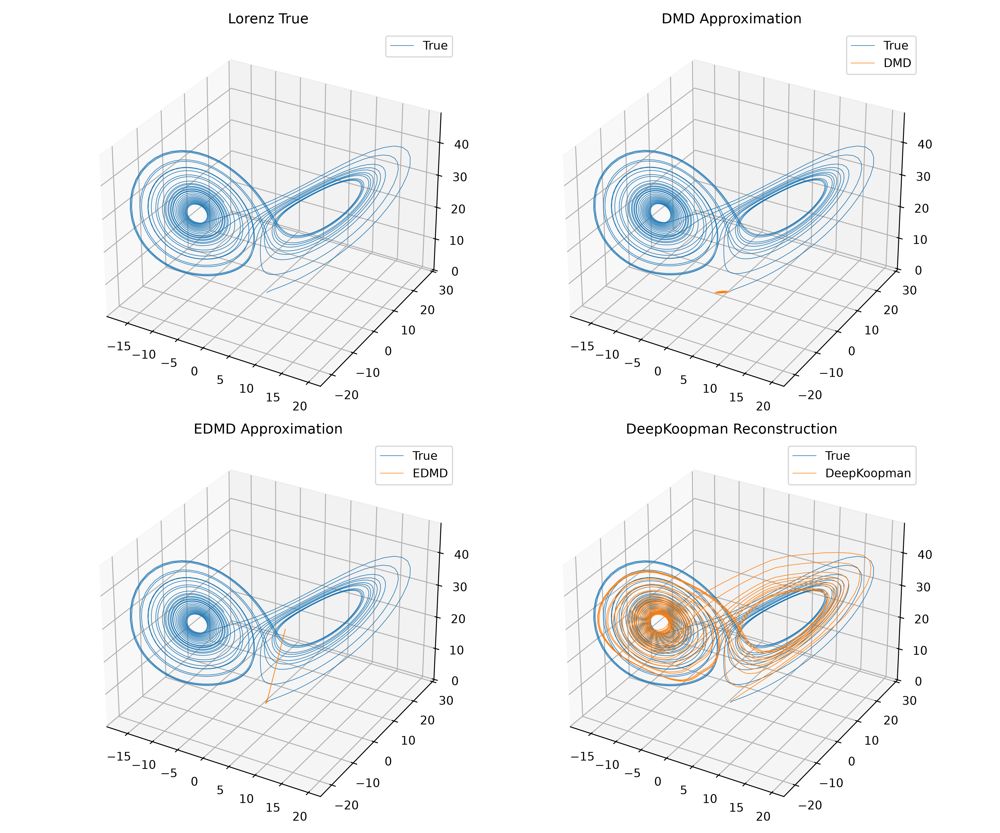

# 🌀 Koopman Operator Learning on the Lorenz Attractor

## 📘 Overview

This project applies **Koopman operator theory** to nonlinear dynamical systems using the **Lorenz attractor** as a benchmark.

Three approaches are compared:

* **DMD (Dynamic Mode Decomposition)** — linear approximation in the original state space.
* **EDMD (Extended Dynamic Mode Decomposition)** — linear approximation in a lifted polynomial feature space.
* **DeepKoopman** — learns a latent representation through an autoencoder where the dynamics become linear.

The goal is to reconstruct and predict chaotic trajectories while analyzing both **reconstruction** and **dynamics errors**.

---

## ⚙️ Dynamical Systems Background

### Lorenz System

The Lorenz system is defined by

$$
\dot{x}=\sigma(y-x)
$$

$$
\dot{y}=x(\rho-z)-y
$$

$$
\dot{z}=xy-\beta z
$$

where:

* $\sigma$ is the Prandtl number,
* $\rho$ is the Rayleigh number,
* $\beta$ is a geometric parameter.

The Lorenz attractor exhibits chaotic behavior and is a classical benchmark for nonlinear dynamical systems.

---

## 🔹 Methods Compared

### 1. Dynamic Mode Decomposition (DMD)

DMD works directly in the original state space and approximates the dynamics by finding a linear operator

$$
x_{t+1}\approx A x_t.
$$

**Strengths**

* Simple and computationally efficient.
* Provides a linear approximation of the dynamics.

**Limitations**

* Struggles with highly nonlinear and chaotic systems.

---

### 2. Extended Dynamic Mode Decomposition (EDMD)

EDMD lifts the state into a higher-dimensional feature space and computes

$$
\phi(x_{t+1})\approx K\phi(x_t),
$$

where $\phi(x)$ denotes the lifted observables.

**Strengths**

* Captures more nonlinear structure than standard DMD.
* Improves prediction accuracy.

**Limitations**

* Requires manually choosing the observables.
* Performance depends on the selected basis functions.

---

### 3. DeepKoopman

DeepKoopman uses an autoencoder to learn a latent representation

$$
z_t=\mathrm{Encoder}(x_t),
$$

where the latent dynamics are linear:

$$
z_{t+1}\approx Kz_t.
$$

The decoder reconstructs the original state:

$$
\hat{x}_t=\mathrm{Decoder}(z_t).
$$

**Strengths**

* Learns both the representation and the dynamics automatically.
* Produces highly accurate reconstructions.

**Limitations**

* Requires training.
* More computationally expensive than DMD and EDMD.

---

## 📐 Evaluation Metrics

To evaluate the performance of DeepKoopman model , we use two the following evaluation metrics:

## 📐 Reconstruction Error

The **reconstruction loss** measures how well the model can reproduce the original state from its latent representation:

$$
\mathcal{L}_{rec} = \frac{1}{N} \sum_{t=1}^{N} \| x_t - \hat{x}_t \|^2
$$

### Where:

- $x_t$: true state of the system at time step $t$  
- $\hat{x}_t$: reconstructed state from the autoencoder at time step $t$  
- $N$: total number of time steps  
- $\|\cdot\|^2$: squared Euclidean norm (mean squared error)

👉 A low reconstruction error means the autoencoder preserves the geometry of the attractor.

---

## ⚙️ Dynamics Error

The **dynamics loss** measures how well the Koopman operator predicts the next latent state:

$$
\mathcal{L}_{dyn} = \frac{1}{N-1} \sum_{t=1}^{N-1} \| z_{t+1}^{true} - K z_t \|^2
$$

### Where:

- $z_t$: latent state at time step $t$, obtained by encoding $x_t$  
- $z_{t+1}^{true}$: latent state at time step $t+1$, obtained by encoding $x_{t+1}$  
- $K$: learned Koopman operator (linear transformation in latent space)  
- $N-1$: number of transitions between consecutive time steps   

👉 A low dynamics error means the Koopman operator correctly captures the temporal evolution of the system in latent space.

### 🧠 Intuition

- **Reconstruction loss** evaluates the *spatial fidelity* of the model: does the autoencoder reproduce the attractor’s shape?  
- **Dynamics loss** evaluates the *temporal fidelity*: does the Koopman operator correctly advance the latent state forward in time?  
- Together, they ensure the model learns both the geometry and the dynamics of the system.


## 🧩 Project Structure

```text id="feyqie"
koopman-lorenz/
│
├── data/
│   └── lorenz.py               # Lorenz attractor generation
│
├── methods/
│   ├── dmd.py                  # Dynamic Mode Decomposition
│   ├── edmd.py                 # Extended Dynamic Mode Decomposition
│   └── simulate.py             # Linear rollout simulation
│
├── models/
│   ├── autoencoder.py          # Encoder-decoder network
│   ├── koopman.py              # Linear Koopman operator
│   └── deep_koopman.py         # DeepKoopman model
│
├── train/
│   └── train_deep_koopman.py   # Training loop
│
├── utils/
│   └── plot.py                 # Plotting utilities
│
└── main.py                     # Full pipeline execution
```

---

## 🧩 Results

The figures below compare the true Lorenz attractor with the trajectories reconstructed using DMD, EDMD, and DeepKoopman.

As expected, the DeepKoopman model provides the most accurate reconstruction and produces a trajectory that nearly overlaps with the true Lorenz attractor.

---

## Results

The image below shows the comparaison of true trajectory and reconstructed trajectories by each of the 3 methods : DMD,EDMD and DeepKoopman model.

### Comparison of All Trajectories

<p align="center">
    
</p>

---

## 🚀 How to Run

Clone the repository

Install the required dependencies:

```bash id="kw2u0c"
pip install -r requirements.txt
```

Run the complete pipeline:

```bash id="vbv1al"
python main.py
```

---

## ⭐ Summary

| Method      | Representation Space     | Dynamics | Reconstruction Quality |
| ----------- | ------------------------ | -------- | :--------------------: |
| DMD         | Original state space     | Linear   |           Low          |
| EDMD        | Polynomial feature space | Linear   |         Medium         |
| DeepKoopman | Learned latent space     | Linear   |          High          |

Among the three approaches, **DeepKoopman achieves the most accurate reconstruction of the Lorenz attractor**, demonstrating the effectiveness of combining Koopman operator theory with deep neural networks.
